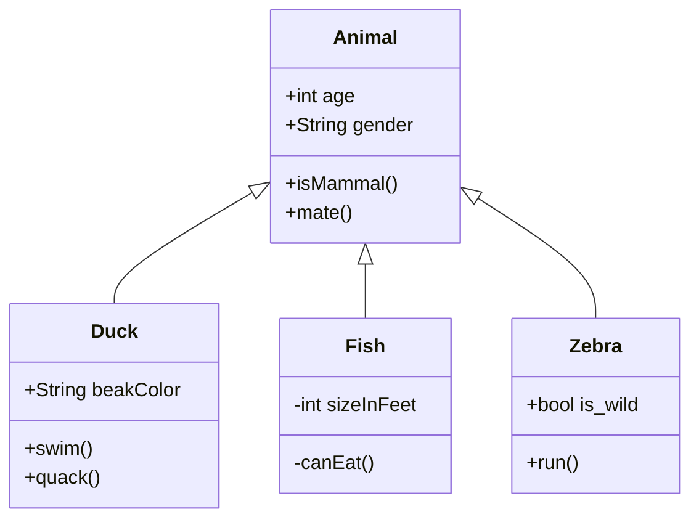
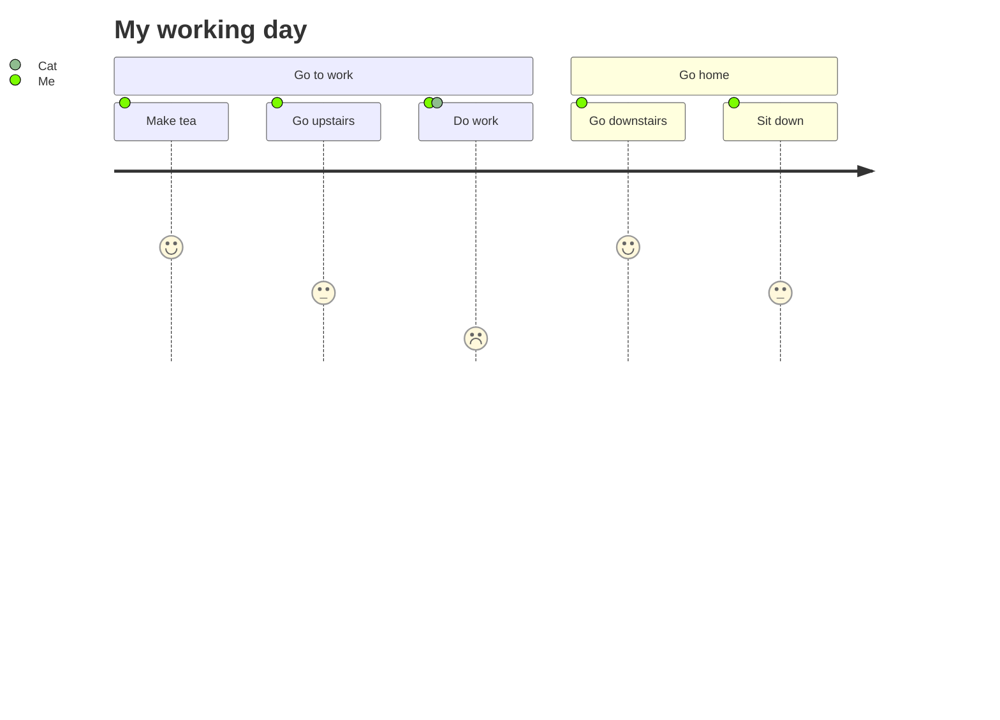
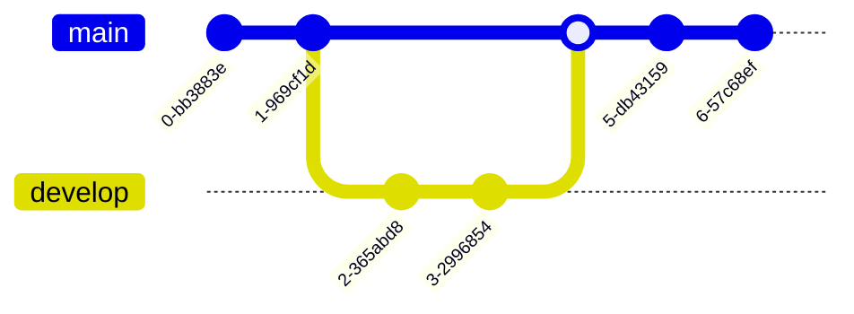
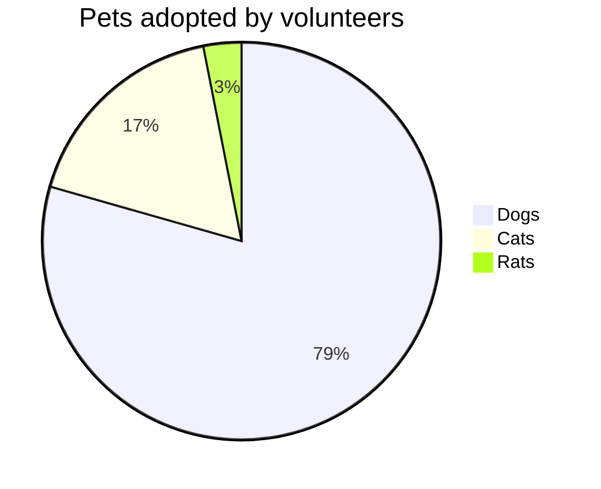
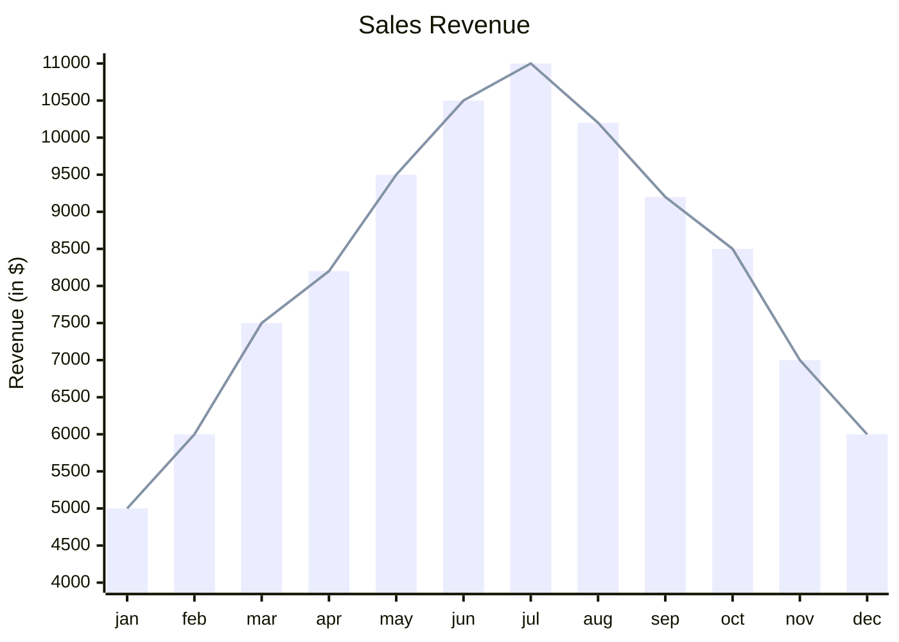

# Graphs

[⬅️ Back to Home](../README.md)

---

[!NOTE]

> See [mermaid.live](https://mermaid.live/) for a live demo

## Creating Mermaid diagrams


## Checking your version of Mermaid

```mermaid
  info
```

## Creating GeoJSON and TopoJSON maps

```geojson
{
  "type": "FeatureCollection",
  "features": [
    {
      "type": "Feature",
      "id": 1,
      "properties": {
        "ID": 0
      },
      "geometry": {
        "type": "Polygon",
        "coordinates": [
          [
            [
              -90,
              35
            ],
            [
              -90,
              30
            ],
            [
              -85,
              30
            ],
            [
              -85,
              35
            ],
            [
              -90,
              35
            ]
          ]
        ]
      }
    }
  ]
}
```

## Using TopoJSON

```topojson
{
  "type": "Topology",
  "transform": {
    "scale": [
      0.0005000500050005,
      0.00010001000100010001
    ],
    "translate": [
      100,
      0
    ]
  },
  "objects": {
    "example": {
      "type": "GeometryCollection",
      "geometries": [
        {
          "type": "Point",
          "properties": {
            "prop0": "value0"
          },
          "coordinates": [
            4000,
            5000
          ]
        },
        {
          "type": "LineString",
          "properties": {
            "prop0": "value0",
            "prop1": 0
          },
          "arcs": [
            0
          ]
        },
        {
          "type": "Polygon",
          "properties": {
            "prop0": "value0",
            "prop1": {
              "this": "that"
            }
          },
          "arcs": [
            [
              1
            ]
          ]
        }
      ]
    }
  },
  "arcs": [
    [
      [
        4000,
        0
      ],
      [
        1999,
        9999
      ],
      [
        2000,
        -9999
      ],
      [
        2000,
        9999
      ]
    ],
    [
      [
        0,
        0
      ],
      [
        0,
        9999
      ],
      [
        2000,
        0
      ],
      [
        0,
        -9999
      ],
      [
        -2000,
        0
      ]
    ]
  ]
}
```

## Creating STL 3D models

```stl
solid cube_corner
  facet normal 0.0 -1.0 0.0
    outer loop
      vertex 0.0 0.0 0.0
      vertex 1.0 0.0 0.0
      vertex 0.0 0.0 1.0
    endloop
  endfacet
  facet normal 0.0 0.0 -1.0
    outer loop
      vertex 0.0 0.0 0.0
      vertex 0.0 1.0 0.0
      vertex 1.0 0.0 0.0
    endloop
  endfacet
  facet normal -1.0 0.0 0.0
    outer loop
      vertex 0.0 0.0 0.0
      vertex 0.0 0.0 1.0
      vertex 0.0 1.0 0.0
    endloop
  endfacet
  facet normal 0.577 0.577 0.577
    outer loop
      vertex 1.0 0.0 0.0
      vertex 0.0 1.0 0.0
      vertex 0.0 0.0 1.0
    endloop
  endfacet
endsolid
```

## Creating flowcharts


## Creating class diagrams



## Creating journey diagrams



## Creating git graphs



## Creating pie charts



## Creating xychart


